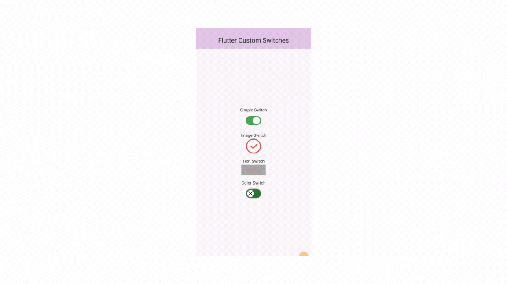

# [Flutter PM Toast](https://pub.dev/packages/fluttertoast)  

Custom Toast Library for Flutter

[](https://pub.dev/packages/pm_toast)


A flutter widget for the display of messages

## Supported Platforms

> - Android
> - IOS
>


## How to Use

```yaml
# add this line to your dependencies
pm_toast: ^1.0.2
```

```dart
import 'package:pm_toast/pm_toast.dart';
```

## Flutrer PM Toast (Android & iOS)

```dart
import 'package:flutter/material.dart';
import 'package:pm_toast/pm_toast.dart';

void main() {
  runApp(MyApp());
}

class MyApp extends StatelessWidget {
  @override
  Widget build(BuildContext context) {
    return MaterialApp(
      debugShowCheckedModeBanner: false,
      home: HomeScreen(),
    );
  }
}

class HomeScreen extends StatelessWidget {
  @override
  Widget build(BuildContext context) {
    return Scaffold(
      appBar: AppBar(
          title: const Center(child: Text(' PM Toast Package ')),
          backgroundColor: Colors.purple[100]),
      body: Center(
        child: Column(
          mainAxisAlignment: MainAxisAlignment.center,
          children: [
            ElevatedButton(
              onPressed: () {
                PMToast(
                  context: context,
                  message: 'This is a simple toast!',
                ).show();
              },
              child: const Text('Show Simple Toast'),
            ),
            const SizedBox(height: 20),
            ElevatedButton(
              onPressed: () {
                PMToast(
                  context: context,
                  message: 'This is a toast with a button!',
                  backgroundColor: Colors.purple,
                  textColor: Colors.white,
                  fontSize: 18.0,
                  borderRadius: const BorderRadius.all(Radius.circular(20.0)),
                  position: ToastPosition.bottom,
                  leftImage: const Icon(Icons.info, color: Colors.white),
                  rightButton: const Icon(Icons.close, color: Colors.white),
                  onRightButtonPressed: () {
                    print('Right button pressed');
                  },
                ).show();
              },
              child: const Text('Show Toast with Button'),
            ),
          ],
        ),
      ),
    );
  }
}

```

| property        | description                                                        | default    |
| --------------- | ------------------------------------------------------------------ |------------|
| message             | String (Not Null)(required)                                        |required    |
| duration     | Duration(seconds: 2) (optional)                 |2 (sec)   |
| toastLength     | Toast.LENGTH_SHORT or Toast.LENGTH_LONG (optional)                 |Toast.LENGTH_SHORT  |
| gravity         | ToastGravity.TOP (or) ToastGravity.CENTER (or) ToastGravity.BOTTOM | ToastGravity.BOTTOM    |
| backgroundColor         | Colors.red                                                         |null   |
| textcolor       | Colors.white                                                       |null    |
| fontSize        | 16.0 (float)                                                       | null      |
| borderRadius        | 8.0 (float)                                                       | 8      |


For more details check the `example` project

| property        | description                                                        | default    |
| --------------- | ------------------------------------------------------------------ |------------|
| child             | Widget (Not Null)(required)                                        |required    |
| toastDuration     | Duration (optional)                                                 |  |
| gravity         | ToastGravity.*    |  |


## Preview Example (BuildContext)
  



## Author
PM Coding

## Contributing 
Contributions, issues, and feature requests are welcome! 

## Show your Support 
Give a star if this project helped you. 

